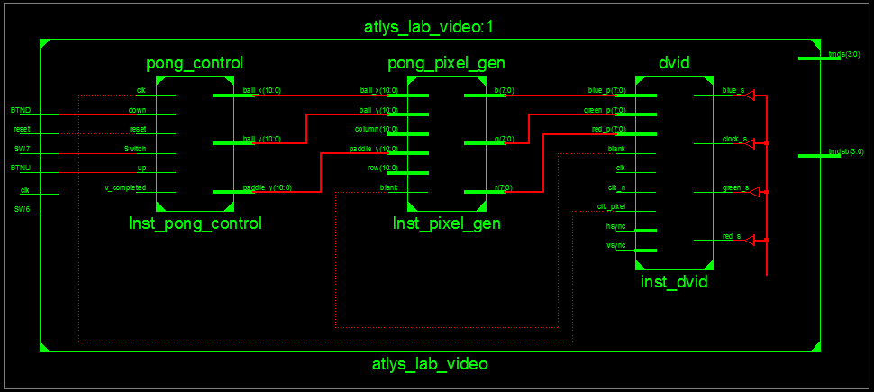
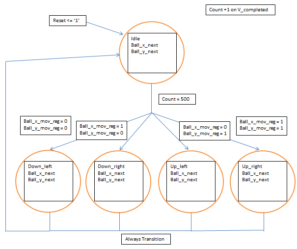

Lab2_Busho
==========

## Introduction
Created a pong game for a computer monitor using an FPGA and VHDL code. I used a state machine to
keep track of the direction the ball was moving. I used combinational logic to move the paddle
via buttons and to bounce the ball off of the walls.


## Implementation
- Used D Flip Flops for next state, current state, count, output buffers, and next output buffers
in the pong control module. For a Moore machine, the output DFF is only hooked up to the current state
while a Mealy machine has its output DFF connected to the inputs and current state DFFs. The combinational
logic uses multiplexers.

  - This is an example of a D Flip Flop

``` VHDL
-- state register
	process(clk, reset)
	begin
		if (reset = '1') then
			state_reg <= idle;
		elsif (clk'event and clk = '1') then
			state_reg <= state_next;
		end if;
	end process;
```

  - This is an example of serveral multiplexers

``` VHDL
count_next <= 	(others => '0') when (count_reg > 1000) and (state_reg /= state_next) else
						count_reg + 1 when v_completed = '1' else
						count_reg;	
```

- I used the pong control module as my state machine to keep track of the ball and paddle. The pixel
gen module was used to color the items on the screen. Both of these modules were instantiated in the
top atlys shell in conjunction with all the VGA components used in Lab1 in order to drive the VGA screen.

- Block Diagram 



- pong_control.vhd state diagram



## Test/Debug

- Made the AF logo, it was not straight, proceeded to draw it out on a piece of paper
- Drew the ball and tried to make it move, realized it was moving too fast and made it move off of 
  a count that counted up on v_completed
- Ball kept 'teleporting every 8 seconds, it was really moving really fast for a split second
- Made my next output buffers only trigger off of v_completed
- Had to do the same to paddle to prevent it from moving really fast
- Had to set my default values for the next output buffers outside of the v_completed if statement 
  to prevent inferred memory
  
## Conclusion
I learned that creating combinational logic whenever possible seems to be easier. Placing everything 
inside process statements has the potential to cause several timing issues and inferred memory. Signals 
may not change when you want them to if you are not careful about what goes inside your process statements.
While debugging may be a pain, this lab has shown me to be extra careful with sensitivity lists and how 
to code memory.
